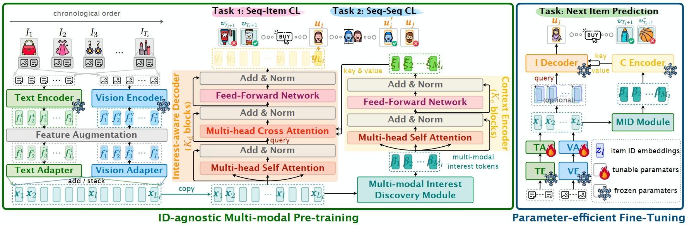

# MISSRec: Pre-training and Transferring Multi-modal Interest-aware Sequence Representation for Recommendation

[toc]

## 1. Introduction



This repository provides the code for our paper at **ACM MM 2023**:

**MISSRec: Pre-training and Transferring Multi-modal Interest-aware Sequence Representation for Recommendation**. Jinpeng Wang, Ziyun Zeng, Yunxiao Wang, Yuting Wang, Xingyu Lu, Tianxiang Li, Jun Yuan, Rui Zhang, Hai-Tao Zheng, Shu-Tao Xia. 📝[[Paper](https://arxiv.org/abs/2308.11175)]. 🖼️[[Poster](misc/poster.pdf)]. 📺[[2-min Video](misc/teaser_video.mp4)]. 🇨🇳[[中文解读](TBD)].

We propose ***MISSRec***, a multi-modal pre-training and transfer learning framework for sequential recommendation. On the user side, we first design a clustering-based interest discovery algorithm to mine users' interests from their multi-modal behaviors. Then, we build a Transformer-based encoder-decoder model, where the encoder learns to capture personalization cues from interest tokens while the decoder is developed to grasp item-modality-interest relations for better sequence representation. On the candidate item side, we adopt a dynamic fusion module to produce user-adaptive item representation. We pre-train the model with contrastive learning objectives and fine-tune it in an efficient manner. Experiments demonstrate the effectiveness and flexibility of MISSRec, indicating a practical solution for real-world recommendation scenarios. 

In the following, we will guide you how to use this repository step by step. 🤗

## 2. Preparation

```bash
git clone https://github.com/gimpong/MM23-MISSRec.git
cd MM23-MISSRec/
```

### 2.1 Requirements

- cuda 11.7
- python 3.7.8
- pytorch 1.13.1
- numpy 1.21.6
- cupy 11.6.0
- tqdm 4.64.1

### 2.2 Data Preparation

Before running the code, we need to make sure that everything needed is ready. The working directory is expected to be organized as below:

<details><summary>MM23-MISSRec/</summary>
<ul>
    <li>fig/</li>
    <li>data/</li>
    <li>reference_log/</li>
    <li>props/</li>
    <li>recbole/</li>
    <li>torchpq/</li>
    <li>saved/</li>
    <ul>
        <li>MISSRec-FHCKM_mm_full-10.pth</li>
        <li>MISSRec-FHCKM_mm_full-20.pth</li>
        <li>...</li>
        <li>MISSRec-FHCKM_mm_full-100.pth</li>
    </ul>
    <li>datasets/</li>
    <ul>
        <li>pretrain/</li>
        <ul>
            <li>FHCKM_mm_full/</li>
        </ul>
        <li>downstream/</li>
        <ul>
            <li>Scientific_mm_subset/</li>
            <li>Scientific_mm_full/</li>
            <li>Pantry_mm_subset/</li>
            <li>Pantry_mm_full/</li>
            <li>Office_mm_subset/</li>
            <li>Office_mm_full/</li>
            <li>Instruments_mm_subset/</li>
            <li>Instruments_mm_full/</li>
            <li>Arts_mm_subset/</li>
            <li>Arts_mm_full/</li>
            <ul>
                <li>Arts_mm_full.feat1CLS</li>
                <li>Arts_mm_full.feat3CLS</li>
                <li>Arts_mm_full.text</li>
                <li>Arts_mm_full.item2index</li>
                <li>Arts_mm_full.user2index</li>
                <li>Arts_mm_full.test.inter</li>
                <li>Arts_mm_full.train.inter</li>
                <li>Arts_mm_full.valid.inter</li>
            </ul>
        </ul>
    </ul>
    <li>scripts/</li>
    <ul>
    	<li>run0001.sh</li>
    	<li>run0002.sh</li>
    	<li>...</li>
    </ul>
    <li>cluster_utils.py</li>
    <li>config.py</li>
    <li>ddp_finetune.py</li>
    <li>ddp_pretrain.py</li>
    <li>finetune.py</li>
    <li>missrec.py</li>
    <li>model_utils.py</li>
    <li>trainer.py</li>
    <li>utils.py</li>
</ul>
</details>

#### Notes

- The pre-processed dataset with extracted features can be downloaded from [Google Drive](https://drive.google.com/file/d/1-k8PZDp7qjEbviQrmQHrbVYYsxaInBEm/view?usp=share_link). For each sub-dataset (e.g., Arts_mm_full), text and image features are saved in files named with suffixes ".feat1CLS" and ".feat3CLS", respectively, e.g., `Arts_mm_full.feat1CLS` and `Arts_mm_full.feat3CLS`. "subset" means the filtered subset of "full" that removes the items with incomplete modalities and only retains the full-modality items.

- Customized feature extraction: We use the pre-trained [CLIP-ViT-B/32](https://github.com/openai/CLIP) as the feature extractor for texts and images. You may want to use other feature extractors for the raw data. The raw text information can be obtained from the review data of the [Amazon](https://nijianmo.github.io/amazon/index.html) dataset. 
For the raw images, you can either crawl them according to URLs or download the version we crawled via [Baidu Cloud (password: **791e**)](https://pan.baidu.com/s/1Y0KplwqPIcQsnvEoJH-gQg). 

- Customized datasets: First, pre-process the user-item interaction data according to the [instructions](https://github.com/RUCAIBox/UniSRec/blob/master/dataset#dataset-preprocessing). Then you may use the pre-trained [CLIP-ViT-B/32](https://github.com/openai/CLIP) to extract multi-modal item features.

- `saved/MISSRec-FHCKM_mm_full-*0.pth` are checkpoint files, which will be generated during the pre-training (See below).

## 3. Pre-training

To pre-train the model for 100 epochs, run the following command in a multi-GPU environment:

```python
# an example: pre-training on 4 GPUs
CUDA_VISIBLE_DEVICES="0,1,2,3" python ddp_pretrain.py
```

We have provided pre-trained checkpoints on [Google Drive](https://drive.google.com/file/d/1jYPKRB1PqkaVMZ3_2ocwykOKsRXoc56N/view?usp=sharing). 

## 4. Fine-tuning or From-scratch Training in Downstream Datasets

For ease of usage, we provide the scripts with configurations for each experiment. These scripts can be found under the `scripts/` folder. For example, if you want to fine-tune the pre-trained checkpoint on the Scientific dataset, you can do

```bash
cd scripts/
# '0' is the id of GPU
bash run01.sh 0
```

The script `run01.sh` includes the running commands:

```bash
#!/bin/bash
cd ..
CUDA_VISIBLE_DEVICES=$1 python finetune.py \
    -d Scientific_mm_full \
    -mode transductive
cd -
```

### 4.1 Main results on downstream domains
<table>
<thead>
  <tr>
    <th>Script</th>
    <th>Dataset</th>
    <th>With ID?</th>
    <th>Pre-trained?</th>
    <th>Log</th>
    <th>R@10</th>
    <th>N@10</th>
    <th>R@50</th>
    <th>N@50</th>
  </tr>
</thead>
<tbody>
  <tr>
    <td><a href="script/run01.sh">run01.sh</a></td>
    <td rowspan="4">Scientific</td>
    <td rowspan="2">✓</td>
    <td>✗</td>
    <td><a href="reference_log/full/Scientific/ID1/PT0/Oct-20-2023_03-18-42.log">log01</a></td>
    <td>0.1282</td>
    <td>0.0711</td>
    <td>0.2376</td>
    <td>0.0946</td>
  </tr>
  <tr>
    <td><a href="script/run02.sh">run02.sh</a></td>
    <td>✓</td>
    <td><a href="reference_log/full/Scientific/ID1/PT1/Oct-20-2023_03-18-38.log">log02</a></td>
    <td>0.136</td>
    <td>0.0753</td>
    <td>0.2431</td>
    <td>0.0983</td>
  </tr>
  <tr>
    <td><a href="script/run03.sh">run03.sh</a></td>
    <td rowspan="2">✗</td>
    <td>✗</td>
    <td><a href="reference_log/full/Scientific/ID0/PT0/Oct-20-2023_03-18-40.log">log03</a></td>
    <td>0.1269</td>
    <td>0.0659</td>
    <td>0.2354</td>
    <td>0.0891</td>
  </tr>
  <tr>
    <td><a href="script/run04.sh">run04.sh</a></td>
    <td>✓</td>
    <td><a href="reference_log/full/Scientific/ID0/PT1/Oct-20-2023_03-27-47.log">log04</a></td>
    <td>0.1278</td>
    <td>0.0658</td>
    <td>0.2375</td>
    <td>0.0893</td>
  </tr>
  <tr>
    <td><a href="script/run05.sh">run05.sh</a></td>
    <td rowspan="4">Pantry</td>
    <td rowspan="2">✓</td>
    <td>✗</td>
    <td><a href="reference_log/full/Pantry/ID1/PT0/Oct-20-2023_03-23-36.log">log05</a></td>
    <td>0.0771</td>
    <td>0.0363</td>
    <td>0.1804</td>
    <td>0.0583</td>
  </tr>
  <tr>
    <td><a href="script/run06.sh">run06.sh</a></td>
    <td>✓</td>
    <td><a href="reference_log/full/Pantry/ID1/PT1/Oct-20-2023_03-24-57.log">log06</a></td>
    <td>0.0779</td>
    <td>0.0365</td>
    <td>0.1875</td>
    <td>0.0598</td>
  </tr>
  <tr>
    <td><a href="script/run07.sh">run07.sh</a></td>
    <td rowspan="2">✗</td>
    <td>✗</td>
    <td><a href="reference_log/full/Pantry/ID0/PT0/Oct-20-2023_03-27-32.log">log07</a></td>
    <td>0.0715</td>
    <td>0.0337</td>
    <td>0.1801</td>
    <td>0.0569</td>
  </tr>
  <tr>
    <td><a href="script/run08.sh">run08.sh</a></td>
    <td>✓</td>
    <td><a href="reference_log/full/Pantry/ID0/PT1/Oct-20-2023_03-33-51.log">log08</a></td>
    <td>0.0771</td>
    <td>0.0345</td>
    <td>0.1833</td>
    <td>0.0571</td>
  </tr>
  <tr>
    <td><a href="script/run09.sh">run09.sh</a></td>
    <td rowspan="4">Instruments</td>
    <td rowspan="2">✓</td>
    <td>✗</td>
    <td><a href="reference_log/full/Instruments/ID1/PT0/Oct-20-2023_03-30-29.log">log09</a></td>
    <td>0.1292</td>
    <td>0.0842</td>
    <td>0.2369</td>
    <td>0.1072</td>
  </tr>
  <tr>
    <td><a href="script/run10.sh">run10.sh</a></td>
    <td>✓</td>
    <td><a href="reference_log/full/Instruments/ID1/PT1/Oct-20-2023_03-32-41.log">log10</a></td>
    <td>0.13</td>
    <td>0.0843</td>
    <td>0.237</td>
    <td>0.1071</td>
  </tr>
  <tr>
    <td><a href="script/run11.sh">run11.sh</a></td>
    <td rowspan="2">✗</td>
    <td>✗</td>
    <td><a href="reference_log/full/Instruments/ID0/PT0/Oct-20-2023_03-43-46.log">log11</a></td>
    <td>0.1207</td>
    <td>0.0771</td>
    <td>0.2191</td>
    <td>0.0981</td>
  </tr>
  <tr>
    <td><a href="script/run12.sh">run12.sh</a></td>
    <td>✓</td>
    <td><a href="reference_log/full/Instruments/ID0/PT1/Oct-20-2023_03-43-56.log">log12</a></td>
    <td>0.1201</td>
    <td>0.0771</td>
    <td>0.2218</td>
    <td>0.0988</td>
  </tr>
  <tr>
    <td><a href="script/run13.sh">run13.sh</a></td>
    <td rowspan="4">Arts</td>
    <td rowspan="2">✓</td>
    <td>✗</td>
    <td><a href="reference_log/full/Arts/ID1/PT0/Oct-20-2023_03-44-08.log">log13</a></td>
    <td>0.1279</td>
    <td>0.0744</td>
    <td>0.2387</td>
    <td>0.0982</td>
  </tr>
  <tr>
    <td><a href="script/run14.sh">run14.sh</a></td>
    <td>✓</td>
    <td><a href="reference_log/full/Arts/ID1/PT1/Oct-20-2023_03-55-46.log">log14</a></td>
    <td>0.1314</td>
    <td>0.0767</td>
    <td>0.241</td>
    <td>0.1002</td>
  </tr>
  <tr>
    <td><a href="script/run15.sh">run15.sh</a></td>
    <td rowspan="2">✗</td>
    <td>✗</td>
    <td><a href="reference_log/full/Arts/ID0/PT0/Oct-20-2023_04-09-49.log">log15</a></td>
    <td>0.1107</td>
    <td>0.0641</td>
    <td>0.2093</td>
    <td>0.0853</td>
  </tr>
  <tr>
    <td><a href="script/run16.sh">run16.sh</a></td>
    <td>✓</td>
    <td><a href="reference_log/full/Arts/ID0/PT1/Oct-20-2023_04-10-22.log">log16</a></td>
    <td>0.1119</td>
    <td>0.0625</td>
    <td>0.21</td>
    <td>0.0836</td>
  </tr>
  <tr>
    <td><a href="script/run17.sh">run17.sh</a></td>
    <td rowspan="4">Office</td>
    <td rowspan="2">✓</td>
    <td>✗</td>
    <td><a href="reference_log/full/Office/ID1/PT0/Oct-20-2023_13-09-03.log">log17</a></td>
    <td>0.1269</td>
    <td>0.0848</td>
    <td>0.2001</td>
    <td>0.1005</td>
  </tr>
  <tr>
    <td><a href="script/run18.sh">run18.sh</a></td>
    <td>✓</td>
    <td><a href="reference_log/full/Office/ID1/PT1/Oct-20-2023_14-52-29.log">log18</a></td>
    <td>0.1275</td>
    <td>0.0856</td>
    <td>0.2005</td>
    <td>0.1012</td>
  </tr>
  <tr>
    <td><a href="script/run19.sh">run19.sh</a></td>
    <td rowspan="2">✗</td>
    <td>✗</td>
    <td><a href="reference_log/full/Office/ID0/PT0/Oct-20-2023_05-19-59.log">log19</a></td>
    <td>0.1072</td>
    <td>0.0694</td>
    <td>0.1726</td>
    <td>0.0834</td>
  </tr>
  <tr>
    <td><a href="script/run20.sh">run20.sh</a></td>
    <td>✓</td>
    <td><a href="reference_log/full/Office/ID0/PT1/Oct-20-2023_05-19-23.log">log20</a></td>
    <td>0.1038</td>
    <td>0.0666</td>
    <td>0.1701</td>
    <td>0.0808</td>
  </tr>
</tbody>
</table>


## 5. References

If you find this code useful or use the toolkit in your work, please consider citing:

```
@inproceedings{wang23missrec,
  title={MISSRec: Pre-training and Transferring Multi-modal Interest-aware Sequence Representation for Recommendation},
  author={Jinpeng Wang and Ziyun Zeng and Yunxiao Wang and Yuting Wang and Xingyu Lu and Tianxiang Li and Jun Yuan and Rui Zhang and Haitao Zheng and Shu-Tao Xia},
  booktitle = {Proceedings of the 31st ACM International Conference on Multimedia},
  year={2023}
}
```

## 6. Acknowledgements

Our code is based on the implementation of [UniSRec](https://github.com/RUCAIBox/UniSRec) and [TorchPQ](https://github.com/DeMoriarty/TorchPQ).

## 7. Contact

If you have any question, you can raise an issue or email Jinpeng Wang (wjp20@mails.tsinghua.edu.cn). We will reply you soon.